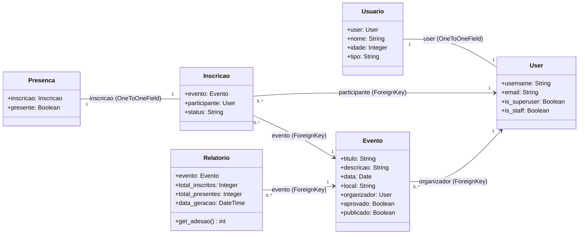
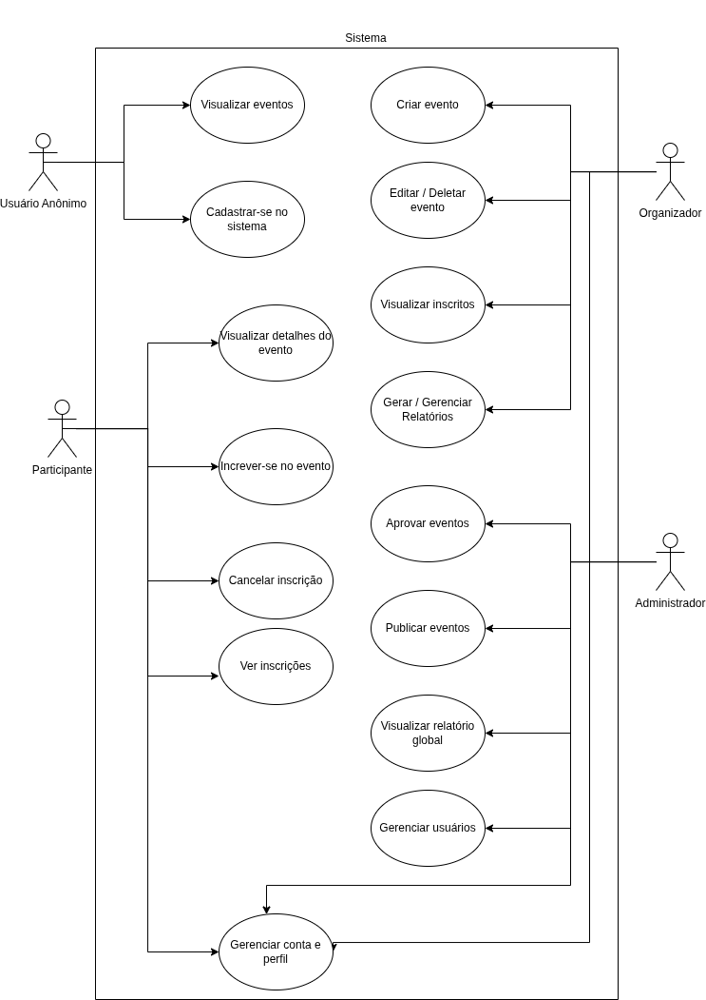

# MeetFlow - Sistema de Gestão de Eventos (API RESTful Segura) 🔒

Este repositório contém o **Trabalho Final** da disciplina de **Laboratório de Programação Web II** do curso de Análise e Desenvolvimento de Sistemas.

O objetivo do projeto é o desenvolvimento de uma aplicação **API RESTful completa e segura utilizando o Django REST Framework (DRF)** com autenticação e autorização providas pelo **Django OAuth Toolkit (DOT)**, integrada a um cliente móvel construído em **Flutter**.

---

## 🎯 Requisitos e Funcionalidades

O sistema conta com a implementação completa dos seguintes requisitos:

1. **API RESTful (Django/DRF)**:
   - Autenticação e autorização via protocolo **OAuth2 (Bearer Token)** usando o Django OAuth Toolkit.
   - Banco de dados composto por **5 modelos relacionados**: `Usuario`, `Evento`, `Inscricao`, `Presenca` e `Relatorio`.
   - **CRUD completo** para recursos principais da aplicação (com destaque para o CRUD completo de inscrições a partir do cliente).
   - Uso apropriado de Serializers e ViewSets.

2. **Cliente Móvel (Flutter)**:
   - Desenvolvido em tecnologia não-Django ([client](file:///home/maiko/Desktop/Projects/MeetFlow-API/client)).
   - Implementa fluxo de Login solicitando tokens via requisição POST ao DOT (`/o/token/`).
   - Persistência criptografada dos tokens no dispositivo e renovação automática de sessão (*Refresh Token*) via interceptores.
   - Interface funcional e responsiva para listagem de eventos (com paginação/infinite scroll), visualização de detalhes, realização de inscrições e cancelamentos.

---

## 🛠️ Tecnologias Utilizadas

- **Backend**: Python, Django, Django REST Framework, Django OAuth Toolkit, PyMySQL.
- **Banco de Dados**: MySQL (produção/desenvolvimento), SQLite (testes automatizados).
- **Cliente**: Dart, Flutter, Dio, Provider, Flutter Secure Storage.
- **Containerização**: Docker e Docker Compose.

---

## ⚙️ Instruções de Execução

### 🐳 A. Execução com Docker (Recomendado)

O Docker Compose inicializa automaticamente os containers da API Django e do Banco de Dados MySQL com todas as migrações aplicadas.

1. **Clone o repositório:**
   ```bash
   git clone https://github.com/Maikoandre/MeetFlow.git
   cd MeetFlow
   ```

2. **Suba os containers:**
   ```bash
   docker compose up --build
   ```

3. **Configure a Aplicação OAuth (Importante!)**
   Em um novo terminal, com os containers rodando, execute o comando para registrar automaticamente a aplicação do aplicativo móvel:
   ```bash
   docker compose exec web python manage.py setup_oauth
   ```

4. **Popule o Banco de Dados com Dados de Teste (Opcional):**
   ```bash
   docker compose exec web python manage.py populate_db
   ```
   *Isso criará o superusuário `admin` com a senha `password123`, 5 organizadores (`org1` a `org5`), 20 participantes (`user1` a `user20`), eventos e inscrições.*

---

### 🔧 B. Execução Manual (Local)

Caso prefira rodar sem Docker, siga os passos abaixo. Certifique-se de ter uma instância **MySQL** rodando localmente.

1. **Crie e ative o ambiente virtual (venv):**
   ```bash
   python -m venv .venv
   source .venv/bin/activate  # No Windows: .venv\Scripts\activate
   ```

2. **Acesse o diretório do backend e instale as dependências (usando uv ou pip):**
   ```bash
   cd api
   uv pip install -r requirements.txt
   # Ou usando pip padrão:
   pip install -r requirements.txt
   ```

3. **Configure as Variáveis de Ambiente do Banco de Dados:**
   ```bash
   export DB_NAME=meetflow_db
   export DB_USER=seu_usuario
   export DB_PASSWORD=sua_senha
   export DB_HOST=localhost
   ```

4. **Rode as Migrações da API e do DOT:**
   ```bash
   python manage.py migrate
   ```

5. **Crie o Superusuário (Admin) e Popule o Banco:**
   ```bash
   python manage.py createsuperuser
   python manage.py populate_db
   ```

6. **Configure a Aplicação OAuth:**
   ```bash
   python manage.py setup_oauth
   ```

7. **Inicie o Servidor:**
   ```bash
   python manage.py runserver
   ```

---

### 📱 C. Execução do Aplicativo Móvel (Flutter)

O aplicativo móvel consome a API RESTful segura e deve ser inicializado a partir do diretório `client/`.

1. **Acesse o diretório do aplicativo:**
   ```bash
   cd client
   ```

2. **Instale as dependências do Flutter:**
   ```bash
   flutter pub get
   ```

3. **Inicie o aplicativo:**
   Certifique-se de ter um emulador Android/iOS ativo ou um dispositivo físico conectado.
   ```bash
   flutter run
   ```

4. **Configuração de Conexão com a API (Login):**
   Ao abrir o aplicativo, insira a URL Base da API correspondente:
   - **Emulador Android**: `http://10.0.2.2:8000/api/` (endereço de loopback para acessar o localhost da máquina hospedeira).
   - **Emulador iOS ou dispositivo físico**: Insira o IP de sua máquina local na rede (ex: `http://192.168.1.100:8000/api/`).
   - Use as credenciais criadas para testes (ex: usuário `user1` com a senha `password123`).

---

## 📂 Estrutura do Repositório

- **`/api` (Backend)**: Contém o código-fonte da API Django (`meetflow/`), app Django (`events/`), Dockerfile e arquivos de gerenciamento de pacotes do backend.
- **`/client` (Cliente)**: Contém o aplicativo móvel desenvolvido em Flutter.

---

## 📊 Diagrama de Classes da API (Modelos Django)

O diagrama abaixo representa a modelagem de dados da API Django do **MeetFlow**:



---

## 🔑 Diagrama Entidade-Relacionamento (ER) da API

O diagrama abaixo ilustra a estrutura física/relacional do banco de dados do **MeetFlow**:

```mermaid
erDiagram
    User ||--|| Usuario : "has profile"
    User ||--o{ Evento : "organizes"
    User ||--o{ Inscricao : "subscribes"
    Evento ||--o{ Inscricao : "includes"
    Inscricao ||--|| Presenca : "records"
    Evento ||--o{ Relatorio : "summarized in"

    User {
        string username
        string email
        boolean is_superuser
        boolean is_staff
    }
    Usuario {
        string nome
        int idade
        string tipo
    }
    Evento {
        string titulo
        string descricao
        date data
        string local
        boolean aprovado
        boolean publicado
    }
    Inscricao {
        string status
    }
    Presenca {
        boolean presente
    }
    Relatorio {
        int total_inscritos
        int total_presentes
        datetime data_geracao
    }
```



---

## 🎭 Diagrama de Casos de Uso da API

O diagrama abaixo ilustra as interações dos diferentes atores (**Administrador**, **Organizador**, **Participante** e **Usuário Anônimo**) com o sistema:




---

## 👥 Integrantes

- Maiko André Antunes de Sousa - 20241GBI02GT0010

---

## 📺 Vídeo de Apresentação

* O video de apresentação se encontra na pasta video do repositório: video/2026-06-08 10-43-32.mp4
