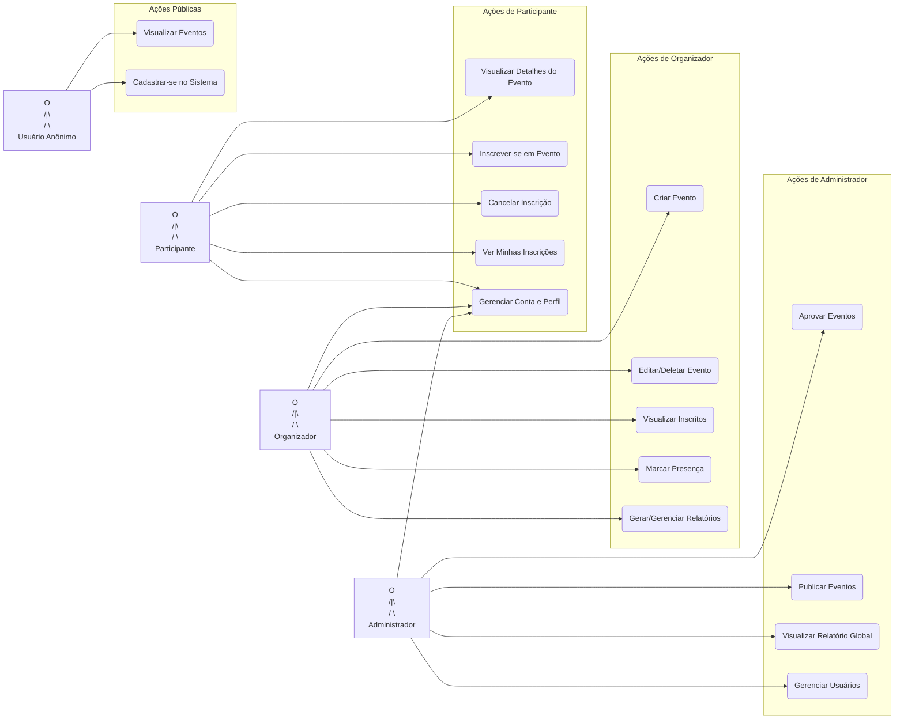

# 📊 Diagrama de Casos de Uso da API

Este documento apresenta o diagrama de Casos de Uso que ilustra as interações dos diferentes atores do sistema (**Administrador**, **Organizador**, **Participante** e **Usuário Anônimo**) com os recursos fornecidos pela API e aplicação web do **MeetFlow**.

