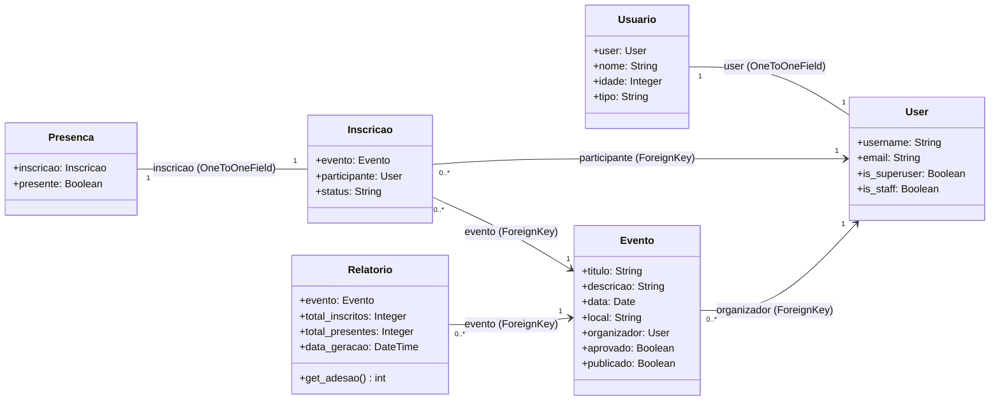

# 📊 Diagrama de Classes da API (Modelos Django)

Este documento contém o diagrama de classes que representa os modelos de dados da API Django do **MeetFlow**.

```mermaid
classDiagram
    direction LR
    class User {
        +username: String
        +email: String
        +is_superuser: Boolean
        +is_staff: Boolean
    }

    class Usuario {
        +user: User
        +nome: String
        +idade: Integer
        +tipo: String
    }

    class Evento {
        +titulo: String
        +descricao: String
        +data: Date
        +local: String
        +organizador: User
        +aprovado: Boolean
        +publicado: Boolean
    }

    class Inscricao {
        +evento: Evento
        +participante: User
        +status: String
    }

    class Presenca {
        +inscricao: Inscricao
        +presente: Boolean
    }

    class Relatorio {
        +evento: Evento
        +total_inscritos: Integer
        +total_presentes: Integer
        +data_geracao: DateTime
        +get_adesao() int
    }

    Usuario "1" -- "1" User : user (OneToOneField)
    Evento "0..*" --> "1" User : organizador (ForeignKey)
    Inscricao "0..*" --> "1" Evento : evento (ForeignKey)
    Inscricao "0..*" --> "1" User : participante (ForeignKey)
    Presenca "1" -- "1" Inscricao : inscricao (OneToOneField)
    Relatorio "0..*" --> "1" Evento : evento (ForeignKey)
```
