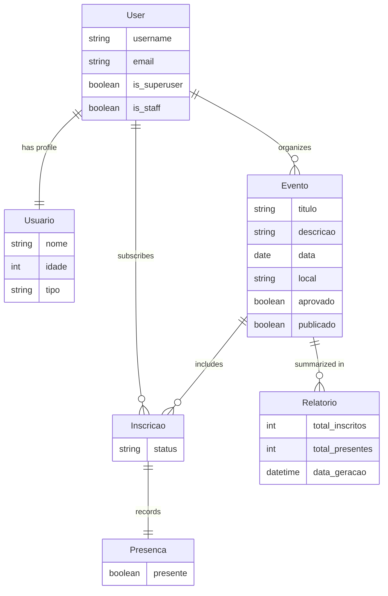

# 📊 Diagrama Entidade-Relacionamento (ER) da API

Este documento contém o diagrama Entidade-Relacionamento (ER) que representa a modelagem física/relacional do banco de dados do **MeetFlow**.

```mermaid
erDiagram
    User ||--|| Usuario : "has profile"
    User ||--o{ Evento : "organizes"
    User ||--o{ Inscricao : "subscribes"
    Evento ||--o{ Inscricao : "includes"
    Inscricao ||--|| Presenca : "records"
    Evento ||--o{ Relatorio : "summarized in"

    User {
        string username
        string email
        boolean is_superuser
        boolean is_staff
    }
    Usuario {
        string nome
        int idade
        string tipo
    }
    Evento {
        string titulo
        string descricao
        date data
        string local
        boolean aprovado
        boolean publicado
    }
    Inscricao {
        string status
    }
    Presenca {
        boolean presente
    }
    Relatorio {
        int total_inscritos
        int total_presentes
        datetime data_geracao
    }
```
